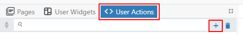
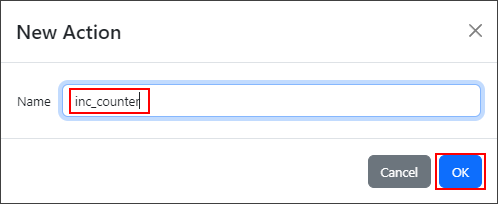
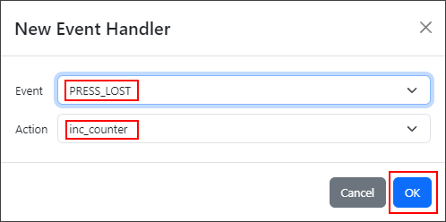
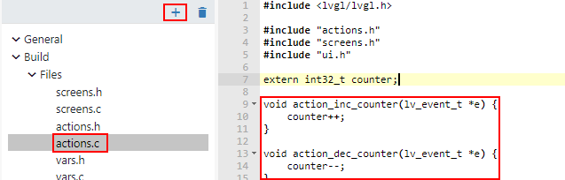
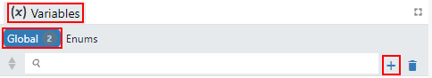
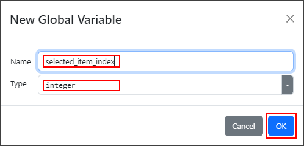
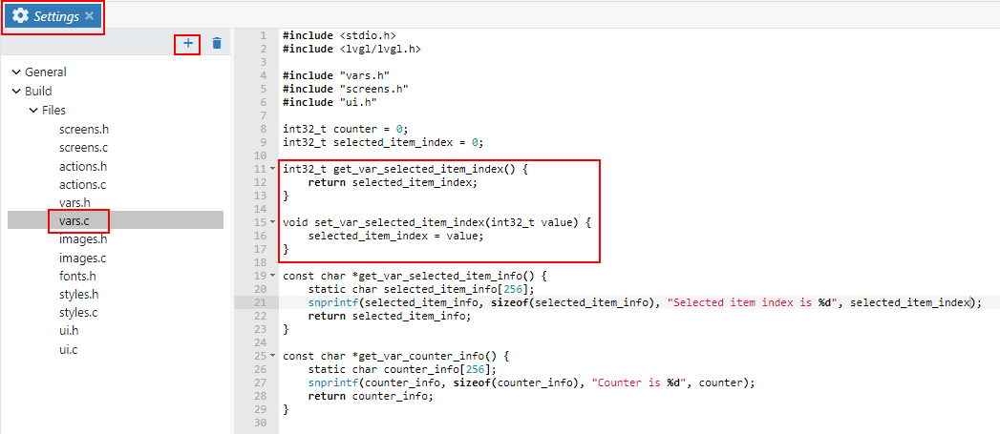

# Example of native interface between EEZ Studio and LVGL when EEZ Flow is not used

## User actions

In LVGL project without EEZ Flow you can still define user actions that can be attached to the event handlers. You are doing this in 3 steps:

- Step 1: Add user actions
  
  Go to User Actions tab, press + button, enter the name of user action and press OK:

  

  

- Step 2: Create event handler and attach it to the user action

  Select widget, for example Button, and in properties find Events section and press + button:

  

  Now, select event and user action and press OK:

  

- Step 3: Implement user action in C

  You need to implement in C function called `void action_<user action name>(lv_event_t * e)`. For example, if user action is called `inc_counter` you need to implement `void action_inc_counter(lv_event_t * e);`. Declaration of all user actions can be found in generated file `actions.h`. You can implement user actions in any C file or you can add `actions.c` file template in your project like this:

  

## Variables

In LVGL project without EEZ Flow you can still define variables that can be used inside widget to add dynamic content. You are doing this in 3 steps:

- Step 1: Add variable

  Go to Variables tab, select Global, press + button, enter the name and type of variable and press OK:

  

  

- Step 2: Use variable inside widget

  

- Step 3: Implement get and set functions in C

  You need to implement in C, for each variable, functions called `<variable type> get_var_<variable name>()` and `void set_var_<variable name>(<variable_type> value)`. For example, if variable is called `selected_item` and type is `integer` you need to implement `int32_t get_var_selected_item();` and `void set_var_selected_item(int32_t value)`. Function declarations for all variables can be found in generated file `vars.h`. You can implement these functions in any C file or you can add `vars.c` file template in your project like this:

  

## How to build project

### Install SDL

Downlad [SDL](https://www.libsdl.org/) (a graphics library to open a window and handle the mouse). On Linux:
1. Find the current version of SDL2: `apt-cache search libsdl2 (e.g. libsdl2-2.0-0)`
2. Install SDL2: `sudo apt-get install libsdl2-2.0-0` (replace with the found version)
3. Install SDL2 development package: `sudo apt-get install libsdl2-dev`
4. If build essentials are not installed yet: `sudo apt-get install build-essential`

### Install Emscripten SDK
Download the [Emscripten SDK](https://kripken.github.io/emscripten-site/) and make sure it is in your PATH.

1. `git clone https://github.com/emscripten-core/emsdk.git`
2. `cd <path-to-emsdk>`
3. `git pull`
4. `./emsdk install latest`
5. `./emsdk activate latest`
6. `source ./emsdk_env.sh`

More info here: https://kripken.github.io/emscripten-site/docs/getting_started/downloads.html

### Build the project
1. `cd C:\work\eez\native-interface-lvgl-no-flow`
2. `mkdir build`
3. `cd build`
4. `emcmake cmake ..`
5. `emmake make -j4`
6. A file called `index.html` will be generated. Run this in your browser.
